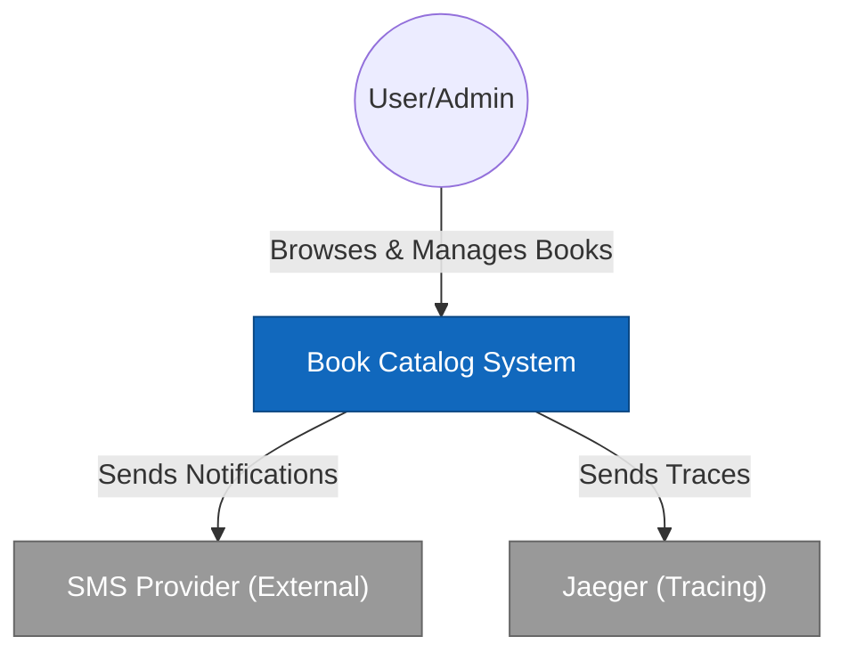

# Архитектура проекта

[← Назад в README](../README.md)

В данном документе описаны ключевые архитектурные решения и диаграммы проекта. Сравнение различных подходов к написанию кода (классический Yii2 MVC, MVC с сервисным слоем и Clean Architecture) подробно описано в [docs/COMPARISON.md](COMPARISON.md). Также мы задокументировали все осознанные компромиссы — те архитектурные решения и ограничения, которые мы приняли ради гармоничной и прагматичной работы с фреймворком, в файле [docs/DECISIONS.md](DECISIONS.md).

## 📌 Навигация

- [🎯 Главное правило Clean Architecture](#-главное-правило-clean-architecture)
- [🏗 Архитектура C4 model](#-архитектура-c4-model)
- [🧭 Архитектурные решения](#-архитектурные-решения)
  - [1. Слой приложения (Use Cases, CQS, Ports)](#1-слой-приложения-use-cases-cqs-ports)
  - [2. Слой домена (Rich Domain Model)](#2-слой-домена-rich-domain-model)
  - [3. Слой представления (Yii2)](#3-слой-представления-yii2)
  - [4. Разделение ответственности: Use Cases vs сервисы представления](#4-разделение-ответственности-use-cases-vs-сервисы-представления)
  - [5. Инфраструктура и окружение](#5-инфраструктура-и-окружение)
  - [6. DTO и формы для валидации](#6-dto-и-формы-для-валидации)
  - [7. Инфраструктурный слой](#7-инфраструктурный-слой)
  - [8. Качество кода и стандарты](#8-качество-кода-и-стандарты)
  - [9. Гибридный поиск (Specification)](#9-гибридный-поиск-specification)
  - [10. Асинхронные операции (fan-out)](#10-асинхронные-операции-fan-out)
  - [11. Пагинация и кеширование](#11-пагинация-и-кеширование)
  - [12. Внедрение зависимостей](#12-внедрение-зависимостей)
  - [13. Наблюдаемость и трассировка](#13-наблюдаемость-и-трассировка)
  - [14. Хранилище файлов (CAS)](#14-хранилище-файлов-cas)
  - [15. Инфраструктурное ядро](#15-инфраструктурное-ядро)
  - [16. Маппинг данных (AutoMapper и Hydrator)](#16-маппинг-данных-automapper-и-hydrator)
- [📁 Структура проекта](#-структура-проекта)

---

## 🎯 Главное правило Clean Architecture

> **Бизнес-логика не знает, как её вызывают и куда сохраняют данные.**

```
Внешние слои (зависят от Yii2):
┌────────────────────────────────────────────────────────────┐
│  PRESENTATION   │ Контроллеры, формы, представления       │
├────────────────────────────────────────────────────────────┤
│  INFRASTRUCTURE │ ActiveRecord, Queue, Repositories       │
└────────────────────────────────────────────────────────────┘
                              ↓ зависят от ↓
Внутренние слои (чистый PHP, без Yii):
┌────────────────────────────────────────────────────────────┐
│  APPLICATION    │ UseCases, Commands, Queries, Ports      │
├────────────────────────────────────────────────────────────┤
│  DOMAIN         │ Entities, Value Objects, Events          │
└────────────────────────────────────────────────────────────┘
```

`application/` и `domain/` не используют Yii2 (в этих слоях нет ссылок на `Yii`), а `presentation/` и `infrastructure/` содержат интеграцию с фреймворком.

[↑ К навигации](#-навигация)

---

## 🏗 Архитектура C4 model

Для визуализации архитектуры на разных уровнях абстракции используется модель C4.

### Level 1: system context

**Схема взаимодействия системы с внешним миром.**



### Level 2: containers

**Инфраструктура и контейнеры (Docker).**


Очередь работает через `yii\queue\db\Queue` (задания хранятся в базе данных MySQL или PostgreSQL). Redis используется как кэш.

### Level 3: components (слой приложения)

**Внутреннее устройство слоя приложения (Clean Architecture).**


[↑ К навигации](#-навигация)

---

## 🧭 Архитектурные решения

### 1. Слой приложения (Use Cases, CQS, Ports)

Чтение и запись разделены по CQS, а внешние зависимости вынесены в порты:

- **Запись (команды):** любое изменение в системе (создание книги, подписка) - это отдельный **Use Case**. Данные поступают через строго типизированные **Command DTO**.
- **Чтение (запросы):** read-side реализован через порты (`BookFinderInterface`, `BookSearcherInterface`). Реализации портов (Query Services) — только в `infrastructure/queries/`. Read DTO (`BookReadDto`, `ReportDto` и т.п.) — в `application/*/queries` (см. DECISIONS.md §15).
- **Контракт DTO-only для `application/*/queries`:** папка содержит **только** read DTO и критерии поиска. Запрещены: сервисы, Use Cases, зависимости от `infrastructure`, бизнес-логика. Разрешены: `final readonly` классы с данными, простые геттеры, `with*()`-методы, `JsonSerializable`. Проверка: phparkitect (final, readonly, NotDependsOn infra).
- **Порты:** интерфейсы в `application/ports` позволяют менять реализацию без изменений бизнес-логики.

[↑ К навигации](#-навигация)

### 2. Слой домена (Rich Domain Model)

Здесь находится бизнес-суть приложения без привязки к вебу и базе данных:

- **Rich Entities:** сущность `Book` управляет статусом и авторами, соблюдая бизнес-правила. Конструктор приватный — создание через `Book::create()`, восстановление из БД через `Book::reconstitute()`.
- **Контроль изменяемости:** доменные сущности используют `private(set)` и меняются через методы.
- **Value Objects:** `Isbn`, `BookYear`, `StoredFileReference`, `FileContent`, `FileKey` гарантируют валидность данных при создании.
- **Status FSM:** статус книги моделируется через `BookStatus` enum (черновик / опубликована / в архиве) с переходами через `transitionTo(target, policy)`.
- **Domain Events:** `BookStatusChangedEvent`, `BookUpdatedEvent`, `BookDeletedEvent` накапливаются в сущности при мутации и связывают части системы без прямых зависимостей.
- **Domain Guards:** `replaceAuthors()` запрещает убирать всех авторов у опубликованных/архивных книг.
- **Specifications:** поиск формализован через `domain/specifications` (`FullTextSpecification`, `IsbnPrefixSpecification`, `AuthorSpecification`, `StatusSpecification`, `YearSpecification`, `CompositeAndSpecification`, `CompositeOrSpecification`).

[↑ К навигации](#-навигация)

### 3. Слой представления (Yii2)

Слой отвечает за UI, HTTP и сценарии пользователя:

- **Контроллеры:** максимально тонкие, ошибки обрабатываются через try/catch `ApplicationException`.
- **Формы:** валидация HTTP-ввода в `presentation/*/forms`.
- **Handlers & view factories:** обработка команд и подготовка данных для UI.
- **Read DTO:** чтение отделено от отображения через `BookReadDto`.
- **Фильтры:** идемпотентность и rate limit оформлены отдельными фильтрами.
- **WebOperationRunner:** централизованный запуск Use Cases, работа с pipeline и обработка ошибок.
- **Command Pipeline:** транзакции, идемпотентность и трассировка вынесены в middleware.
- **HTMX:** фронт использует HTMX для бесшовной подгрузки и фильтрации.

[↑ К навигации](#-навигация)

### 4. Разделение ответственности: Use Cases vs сервисы представления

**Use Cases (слой приложения)** - бизнес-логика:

- Работают с Command/DTO объектами;
- Не знают о формах, HTTP и формате ответа;
- Независимы от способа представления.

**Слой представления** разделен на Handlers и view factories:

- **Command Handlers:** маппят форму в команду через `CommandMapper` и вызывают Use Case через `WebOperationRunner`.
- **View factories:** подготавливают данные для отображения.
- **Контроллер:** координирует HTTP и делегирует работу.

**Пример разделения:**

```php
// presentation/controllers/BookController.php
public function actionCreate(): string|Response
{
    $form = $this->itemViewFactory->createForm();

    if (!$this->request->isPost || !$form->loadFromRequest($this->request)) {
        return $this->renderCreateForm($form);
    }

    if ($this->request->isAjax) {
        return $this->asJson(ActiveForm::validate($form));
    }

    if (!$form->validate()) {
        return $this->renderCreateForm($form);
    }

    try {
        $bookId = $this->commandHandler->createBook($form);
        return $this->redirect(['view', 'id' => $bookId]);
    } catch (ApplicationException $e) {
        $this->addFormError($form, $e);
        return $this->renderCreateForm($form);
    }
}
```

```php
// presentation/books/handlers/BookCommandHandler.php
public function createBook(BookForm $form): int
{
    $cover = $this->operationRunner->runStep(
        fn(): ?string => $this->processCoverUpload($form),
        'Failed to upload book cover',
    );

    if ($form->cover instanceof UploadedFile && $cover === null) {
        throw new OperationFailedException('file.error.storage_operation_failed', field: 'cover');
    }

    $command = $this->commandMapper->toCreateCommand($form, $cover);

    $result = $this->operationRunner->executeAndPropagate(
        $command,
        $this->createBookUseCase,
        Yii::t('app', 'book.success.created'),
    );
    assert(is_int($result));

    return $result;
}
```

[↑ К навигации](#-навигация)

### 5. Инфраструктура и окружение

- Переключение между MySQL и PostgreSQL управляется `DB_DRIVER` и конфигами `config/db.php`.
- Очередь реализована через `HandlerAwareQueue`, задания хранятся в базе.
- Время инкапсулировано через `Psr\Clock\ClockInterface` и `SystemClock`.
- Трассировка интегрирована с Jaeger OTLP.
- Интерактивная отладка доступна через `make shell`.

[↑ К навигации](#-навигация)

### 6. DTO и формы для валидации

- Формы валидируют HTTP-ввод в `presentation/*/forms`.
- Команды (`CreateBookCommand`, `UpdateBookCommand`) живут в `application/*/commands`.
- Read-side DTO (`BookReadDto`, `ReportDto` и др.) — в `application/*/queries`. **Контракт DTO-only:** только `final readonly` классы-контейнеры данных, без сервисов и инфраструктурных зависимостей. Реализации Query Services — только в `infrastructure/queries` (см. DECISIONS §15).
- Пагинация оформлена через `PaginationDto` и `PagedResultInterface`.

[↑ К навигации](#-навигация)

### 7. Инфраструктурный слой

- ActiveRecord модели размещены в `infrastructure/persistence` и используются только внутри инфраструктуры.
- Репозитории и Query Services реализуют порты в `infrastructure/repositories` и `infrastructure/queries`.
- События публикуются через `YiiEventPublisherAdapter`, маппинг в jobs делает `EventToJobMapper`.
- Оптимистическая блокировка включена в `infrastructure/persistence/Book.php` через `OptimisticLockBehavior`, конфликты версий транслируются в `StaleDataException`.

[↑ К навигации](#-навигация)

### 8. Качество кода и стандарты

- Строгая типизация (`declare(strict_types=1)`) во всех PHP-файлах.
- PHPStan level 9, кастомные правила в `infrastructure/phpstan`.
- PHPStan правила: `QueryPortsMustReturnDtoRule`, `NoActiveRecordInDomainOrApplicationRule`, `NoGhostQueryServiceInApplicationRule`, `DomainEntitiesMustBePureRule`, `DomainIsCleanRule`, `DisallowDateTimeRule`, `DisallowYiiTOutsideAdaptersRule`, `StrictRepositoryReturnTypeRule`, `UseCaseMustBeFinalRule`, `ValueObjectMustBeFinalRule`.
- Rector для авто-рефакторинга и миграций синтаксиса.
- Код-стайл через `phpcs.xml.dist`.
- Архитектурные ограничения через Deptrac и Arkitect.
- Arkitect: `application/*/queries` — final, readonly, NotDependsOn(infrastructure) (контракт DTO-only).

[↑ К навигации](#-навигация)

### 9. Гибридный поиск (Specification)

- Критерии поиска формируются в `BookSearchSpecificationFactory`.
- Спецификации (`FullTextSpecification`, `IsbnPrefixSpecification`, `AuthorSpecification`, `StatusSpecification`, `YearSpecification`) живут в `domain/specifications`.
- Композитные спецификации (`CompositeAndSpecification`, `CompositeOrSpecification`) позволяют комбинировать критерии.
- `ActiveQueryBookSpecificationVisitor` строит запросы под MySQL/PgSQL и делает fallback на `LIKE`.
- Для ISBN используется префиксный поиск, для года — точное совпадение.
- Поиск по авторам идет через отдельную спецификацию и подзапрос.
- Публичный каталог использует `searchPublished()` — поиск только среди опубликованных книг через `StatusSpecification`.
- В UI используется HTMX для фильтрации без полной перезагрузки страницы.

[↑ К навигации](#-навигация)

### 10. Асинхронные операции (fan-out)

Чтобы тяжелые задачи не тормозили интерфейс:

1. Сущность Book регистрирует событие при `transitionTo()`; репозиторий публикует накопленные события при `save()`.
2. `EventJobMappingRegistry` маппит событие в `NotifySubscribersJob` условно (только если новый статус = `Published`).
3. `NotifySubscribersHandler` создает отдельный `NotifySingleSubscriberJob` для каждого подписчика.

Идемпотентность фоновой рассылки обеспечивается через `AsyncIdempotencyStorageInterface` внутри `NotifySingleSubscriberHandler`.

Результат: интерфейс отвечает сразу, а рассылка выполняется параллельно в фоне.

[↑ К навигации](#-навигация)

### 11. Пагинация и кеширование

- Query Services возвращают `PagedResultInterface` с `PaginationDto`.
- Query Services не отдают `ActiveDataProvider`, чтобы не тащить Yii2 в слой приложения.
- В presentation-layer используется адаптер `PagedResultDataProvider`.
- Кэширование отчетов реализовано в `ReportQueryServiceCachingDecorator`, инвалидация - через `ReportCacheInvalidationListener`.

[↑ К навигации](#-навигация)

### 12. Внедрение зависимостей

- Зависимости передаются через конструкторы и настраиваются в `config/container/*.php`.
- В слоях application/domain нет обращений к `Yii::$app`.
- Фоновые задачи остаются DTO благодаря `HandlerAwareQueue` и `JobHandlerRegistry`.

[↑ К навигации](#-навигация)

### 13. Наблюдаемость и трассировка

- Трассировка команд реализована через `TracingMiddleware`.
- Инфраструктурные декораторы (`*TracingDecorator`) оборачивают репозитории, Query Services и очередь.
- Сбор трейсов выполняется поверх OpenTelemetry (OTLP) с экспортом в Jaeger.
- В панели Jaeger доступны waterfall timeline, структура вызовов RPC, и поиск трейсов по тегам.

[↑ К навигации](#-навигация)

### 14. Хранилище файлов (CAS)

- Файловое хранилище реализовано через `ContentAddressableStorage`.
- Ключи формируются через `FileKey`, а домен работает с `StoredFileReference`.
- Имя файла = sha256 от содержимого, что дает дедупликацию.
- Домен не знает о путях к файлам, он оперирует ссылками на контент.

[↑ К навигации](#-навигация)

### 15. Инфраструктурное ядро

- `BaseActiveRecordRepository` содержит Identity Map на основе `WeakMap`, переводит ошибки БД в доменные исключения и обрабатывает `StaleObjectException` → `StaleDataException`.
- `BaseQueryService` стандартизирует пагинацию и маппинг в DTO.

[↑ К навигации](#-навигация)

### 16. Маппинг данных (AutoMapper и Hydrator)

- Read-side использует `AutoMapper` и атрибуты `#[MapTo]` в ActiveRecord моделях.
- Write-side использует `ActiveRecordHydrator` в репозиториях (например, `BookRepository`).

[↑ К навигации](#-навигация)

---

## 📁 Структура проекта

```text
domain/                 - Слой домена (Business Logic)
  ├── common/           - Общие доменные элементы
  ├── entities/         - Сущности (Rich Model)
  ├── events/           - Domain Events
  ├── exceptions/       - Исключения домена
  ├── services/         - Domain Services (редко)
  ├── specifications/   - Specifications (criteria)
  ├── values/           - Value Objects (Immutable)
  application/            - Слой приложения (Application Logic)
  ├── common/           - Общие DTO и валидаторы
  ├── ports/            - Интерфейсы (Ports)
  ├── {{module}}/
  │   ├── commands/     - DTO команд (Write)
  │   ├── exceptions/   - Исключения модуля
  │   ├── factories/    - Фабрики модуля
  │   ├── mappers/      - Mappers модуля
  │   ├── queries/      - DTO чтения (Read), DTO-only: final readonly, без infra
  │   ├── usecases/     - Классы Use Case (execute)
infrastructure/         - Инфраструктурный слой (Framework Logic)
  ├── adapters/         - Адаптеры инфраструктуры
  ├── components/       - Вспомогательные компоненты
  ├── factories/        - Фабрики инфраструктуры
  ├── listeners/        - Event Listeners
  ├── mapping/          - Настройки маппинга
  ├── persistence/      - ActiveRecord модели (Mapping)
  ├── phpstan/          - Расширения и правила PHPStan
  ├── queries/          - Query Services
  ├── queue/            - Обработчики очередей
  ├── repositories/     - Реализации Repository (через AR)
  ├── services/         - Внешние сервисы
presentation/           - Слой представления (UI/API)
  ├── common/           - Общие компоненты
  ├── components/       - UI компоненты
  ├── controllers/      - Общие контроллеры
  ├── dto/              - DTO уровня представления
  ├── mail/             - Шаблоны писем
  ├── services/         - Общие сервисы представления
  ├── views/            - Шаблоны представлений
  ├── widgets/          - UI виджеты
  ├── {{module}}/
  │   ├── dto/          - DTO уровня представления
  │   ├── forms/        - Формы валидации
  │   ├── handlers/     - Обработчики запросов
  │   ├── mappers/      - Mappers модуля
  │   ├── services/     - Сервисы модуля
  │   ├── validators/   - Валидаторы модуля
  │   ├── widgets/      - Виджеты модуля
assets/                 - Frontend assets
bin/                    - CLI утилиты
  ├── lib/              - Библиотеки CLI утилит
commands/               - Console контроллеры
  ├── support/          - Служебные утилиты и вывод карты проекта
config/                 - Конфигурация приложения
  ├── container/        - Конфигурация контейнера зависимостей
docker/                 - Docker конфигурация
  ├── nginx/            - Конфигурация nginx
docs/                   - Документация
  ├── ai/               - Правила и инструкции для AI
  ├── auto/             - Автоматизированные материалы
messages/               - Переводы i18n
migrations/             - Миграции БД
runtime/                - Runtime кэш и логи
tests/                  - Тесты
tools/                  - Инструменты разработки
  ├── PHPUnit/          - Конфигурация PHPUnit
  ├── Rector/           - Конфигурация Rector
web/                    - Web root
```

Список модулей:

| Модуль        | Назначение              |
| ------------- | ----------------------- |
| auth          | Авторизация и сессии    |
| authors       | Управление авторами     |
| books         | Каталог книг            |
| reports       | Аналитические отчеты    |
| subscriptions | Подписки на уведомления |

**Независимы от Yii:** `application/` и `domain/`.

**Зависят от Yii:** `infrastructure/` и `presentation/`.

[↑ К навигации](#-навигация)
