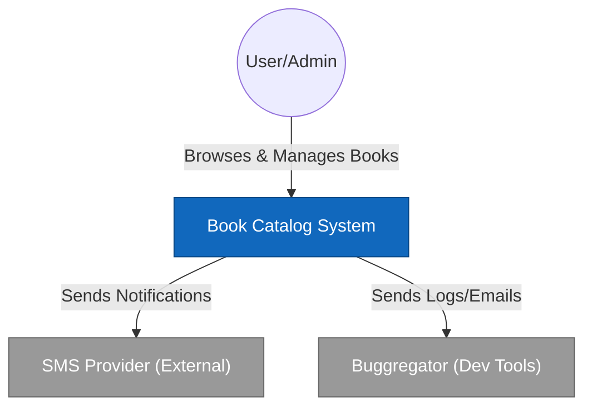
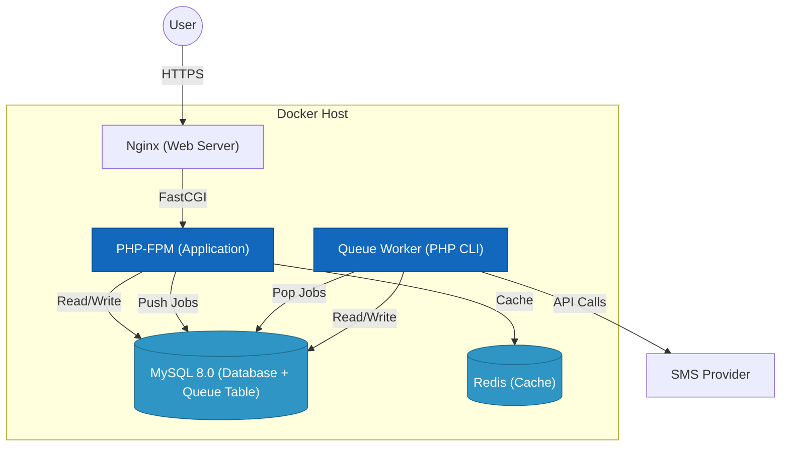
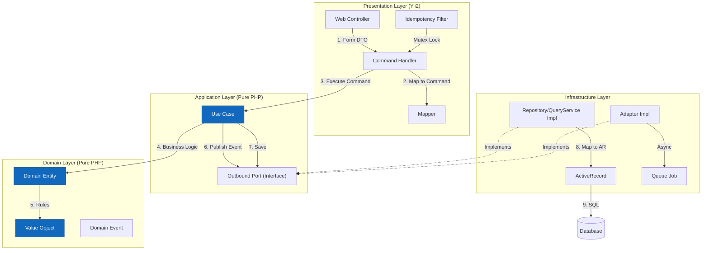

# Архитектура проекта

[← Назад в README](../README.md)

В данном документе описаны ключевые архитектурные решения. Это **Clean-ish** архитектура: не строго Clean, но максимально близко к идеалу с учетом практических ограничений Yii2.


## 📌 Навигация
- [🎯 Главное правило](#-главное-правило-clean-architecture)
- [🗺 Визуализация слоев (Mermaid)](#-визуализация-слоев-mermaid)
- [📊 Три уровня организации кода](#-три-уровня-организации-кода)
- [🔄 Пример: Создание книги (Уровни 1, 2, 3)](#-пример-создание-книги)
- [📈 Сравнительная таблица](#-сравнительная-таблица)
- [🧩 Разбор паттернов (Было → Стало)](#-каждый-паттерн-было--стало)
- [📁 Структура проекта](#-структура-этого-проекта)

---

## 🎯 Главное правило Clean Architecture

> **Бизнес-логика не знает, как её вызывают и куда сохраняют данные.**

```
Внешние слои (зависят от Yii2):
┌────────────────────────────────────────────────────────────┐
│  PRESENTATION   │ Controllers, Forms, Views               │
├────────────────────────────────────────────────────────────┤
│  INFRASTRUCTURE │ ActiveRecord, Queue, Repositories       │
└────────────────────────────────────────────────────────────┘
                              ↓ зависят от ↓
Внутренние слои (чистый PHP, без Yii):
┌────────────────────────────────────────────────────────────┐
│  APPLICATION    │ UseCases, Commands, Queries, Ports      │
├────────────────────────────────────────────────────────────┤
│  DOMAIN         │ Entities, Value Objects, Events          │
└────────────────────────────────────────────────────────────┘
```

### 🏗 Архитектура C4 Model

Мы используем модель C4 для визуализации архитектуры на разных уровнях абстракции.

#### Level 1: System Context
**Схема взаимодействия системы с внешним миром.**



#### Level 2: Containers
**Инфраструктура и контейнеры (Docker).**



Очередь работает через DB-драйвер (`yii\queue\db\Queue`): задания лежат в MySQL. Redis используется только как кэш.

#### Level 3: Components (Application Layer)
**Внутреннее устройство Application Layer (Clean Architecture).**



### 🎯 Основные принципы реализации

1. **Инверсия зависимостей (DIP)**: слой Application не зависит от Infrastructure. Вместо этого он определяет интерфейсы (Ports), которые Infrastructure реализует. Это позволяет легко заменить MySQL на PostgreSQL или SMS-провайдера без изменения бизнес-логики.
2. **Тонкие контроллеры и AR**: Yii2 ActiveRecord используется **только** в слое Infrastructure как детали хранения. В контроллерах нет прямого обращения к моделям для записи или сложной выборки.
3. **Предсказуемость (Value Objects)**: данные всегда валидны. Если объект `Isbn` или `BookYear` создан — значит данные в нем корректны. Это избавляет от тысяч проверок `if` в коде.

### Что это значит?

**UseCase (`CreateBookUseCase`) не знает:**
- Это HTTP-запрос или CLI-команда?
- Данные из HTML-формы или из REST API?
- Сохраняем в MySQL, PostgreSQL или MongoDB?
- SMS шлём через Twilio или пишем в файл?

**Почему Presentation и Infrastructure зависят от Yii2 — это нормально:**
- Presentation = интерфейс с пользователем. Контроллеры, формы, виджеты — это Yii2.
- Infrastructure = реализация хранения. ActiveRecord, Queue — это тоже Yii2.
- Это **внешние слои** — они по определению зависят от технологий.

**Почему Application и Domain чистые — это критично:**
- Можно перенести в Symfony/Laravel без изменений.
- Можно тестировать без базы данных и HTTP.
- Бизнес-правила не меняются при смене фреймворка.

---

## 📊 Три уровня организации кода

| Уровень | Подход | Типичный проект |
|---------|--------|-----------------|
| **1** | Толстый контроллер | Новичок, быстрый прототип |
| **2** | Контроллер + Сервис | Большинство Yii2/Laravel проектов |
| **3** | Clean Architecture | Enterprise, сложная бизнес-логика |

---

## 🔄 Пример: Создание книги

### Уровень 1: Толстый контроллер

```php
// controllers/BookController.php
public function actionCreate()
{
    $model = new Book();
    
    if ($model->load(Yii::$app->request->post())) {
        // Загрузка файла
        $file = UploadedFile::getInstance($model, 'coverFile');
        if ($file) {
            $path = 'uploads/' . uniqid() . '.' . $file->extension;
            $file->saveAs(Yii::getAlias('@webroot/' . $path));
            $model->cover_url = '/' . $path;
        }
        
        // Валидация ISBN (копипаста из интернета)
        $isbn = str_replace(['-', ' '], '', $model->isbn);
        if (strlen($isbn) !== 13 || !ctype_digit($isbn)) {
            $model->addError('isbn', 'Неверный ISBN');
        }
        
        if (!$model->hasErrors() && $model->save()) {
            // Синхронизация авторов
            Yii::$app->db->createCommand()
                ->delete('book_authors', ['book_id' => $model->id])
                ->execute();
            foreach ($model->authorIds as $authorId) {
                Yii::$app->db->createCommand()->insert('book_authors', [
                    'book_id' => $model->id,
                    'author_id' => $authorId,
                ])->execute();
            }
            
            // Уведомления подписчикам
            $phones = Subscription::find()
                ->select('phone')
                ->where(['author_id' => $model->authorIds])
                ->column();
            foreach ($phones as $phone) {
                $sms = new SmsClient(Yii::$app->params['smsApiKey']);
                $sms->send($phone, "Новая книга: {$model->title}");
            }
            
            Yii::$app->session->setFlash('success', 'Книга создана');
            return $this->redirect(['view', 'id' => $model->id]);
        }
    }
    
    return $this->render('create', [
        'model' => $model,
        'authors' => ArrayHelper::map(Author::find()->all(), 'id', 'fio'),
    ]);
}
```

#### ✅ Плюсы:
- Быстро написать (30 минут)
- Всё в одном месте — легко найти
- Не нужно думать об архитектуре

#### ❌ Минусы:
- **60+ строк** в одном методе
- `actionUpdate` — копипаста с 80% совпадением
- SMS блокирует ответ страницы (100 подписчиков = 30 сек)
- Тесты? Нужен Yii + база + файловая система + SMS API
- Поменял валидацию ISBN — трогаешь контроллер
- Поменял отправку SMS — трогаешь контроллер

---

### Уровень 2: Контроллер + Сервис

```php
// controllers/BookController.php
public function actionCreate()
{
    $model = new Book();
    
    if ($model->load(Yii::$app->request->post()) && $model->validate()) {
        $service = new BookService();
        $bookId = $service->create($model);
        
        if ($bookId) {
            Yii::$app->session->setFlash('success', 'Книга создана');
            return $this->redirect(['view', 'id' => $bookId]);
        }
    }
    
    return $this->render('create', [
        'model' => $model,
        'authors' => ArrayHelper::map(Author::find()->all(), 'id', 'fio'),
    ]);
}
```

```php
// services/BookService.php
class BookService
{
    public function create(Book $model): ?int
    {
        $transaction = Yii::$app->db->beginTransaction();
        
        try {
            // Загрузка файла
            $file = UploadedFile::getInstance($model, 'coverFile');
            if ($file) {
                $path = 'uploads/' . uniqid() . '.' . $file->extension;
                $file->saveAs(Yii::getAlias('@webroot/' . $path));
                $model->cover_url = '/' . $path;
            }
            
            if (!$model->save()) {
                throw new \Exception('Ошибка сохранения');
            }
            
            $this->syncAuthors($model->id, $model->authorIds);
            $transaction->commit();
            
            $this->notifySubscribers($model);
            
            return $model->id;
        } catch (\Exception $e) {
            $transaction->rollBack();
            Yii::error($e->getMessage());
            return null;
        }
    }
    
    private function syncAuthors(int $bookId, array $authorIds): void
    {
        // ... синхронизация
    }
    
    private function notifySubscribers(Book $model): void
    {
        // ... SMS
    }
}
```

#### ✅ Плюсы:
- Контроллер тонкий (15 строк)
- Логика переиспользуется (Create/Update могут вызывать сервис)
- Легче читать

#### ❌ Минусы:
- Сервис всё ещё **зависит от `Book` (ActiveRecord)**
- Сервис знает про `UploadedFile`, `Yii::$app`
- **Тестирование:** всё ещё нужна вся инфраструктура
- SMS всё ещё блокирует запрос
- Один сервис на 200+ строк (BookService делает ВСЁ)
- Сервис — это "толстый контроллер, вынесенный в класс"

---

### Уровень 3: Clean Architecture (этот проект)

```php
// presentation/controllers/BookController.php
public function actionCreate(): string|Response|array
{
    $form = new BookForm();

    if ($this->request->isPost && $form->loadFromRequest($this->request)) {
        if ($this->request->isAjax) {
            $this->response->format = Response::FORMAT_JSON;
            return ActiveForm::validate($form);
        }

        if ($form->validate()) {
            $bookId = $this->commandHandler->createBook($form);
            if ($bookId !== null) {
                return $this->redirect(['view', 'id' => $bookId]);
            }
        }
    }

    return $this->render('create', [
        'model' => $form,
        'authors' => $this->viewDataFactory->getAuthorsList(),
    ]);
}
```

```php
// presentation/books/handlers/BookCommandHandler.php
public function createBook(BookForm $form): ?int
{
    $coverPath = $this->uploadCover($form);
    
    try {
        $command = $this->mapper->toCreateCommand($form, $coverPath);
        $bookId = $this->createBookUseCase->execute($command);
        $this->notifier->success(Yii::t('app', 'Book has been created'));
        return $bookId;
    } catch (DomainException $e) {
        $this->cleanupFile($coverPath);
        $this->addFormError($form, $e); // Маппинг ошибки на поле формы
        return null;
    }
}
```

```php
// application/books/usecases/CreateBookUseCase.php
public function execute(CreateBookCommand $command): int
{
    $this->transaction->begin();
    
    try {
        $book = Book::create(
            title: $command->title,
            year: new BookYear($command->year),
            isbn: new Isbn($command->isbn),
            description: $command->description,
            coverUrl: $command->cover
        );
        
        $book->replaceAuthors($command->authorIds);
        $this->bookRepository->save($book);
        $bookId = $book->getId();
        
        // Отправка события ТОЛЬКО после успешного коммита
        $this->transaction->afterCommit(fn() => 
            $this->eventPublisher->publishEvent(new BookCreatedEvent($bookId))
        );
        
        $this->transaction->commit();
        return $bookId;
    } catch (\Throwable $e) {
        $this->transaction->rollBack();
        throw $e;
    }
}
```

```php
// domain/values/Isbn.php
final readonly class Isbn
{
    public string $value;
    
    public function __construct(string $isbn)
    {
        $normalized = $this->normalize($isbn);
        if (!$this->isValidChecksum($normalized)) {
            throw new DomainException("Неверный ISBN: {$isbn}");
        }
        $this->value = $normalized;
    }
}
```

#### ✅ Плюсы:
- **UseCase не знает про Yii** — чистый PHP
- **Тестируется изолированно** — mock-аем интерфейсы
- **SMS в очереди** — страница отвечает мгновенно
- **Value Object** — невозможно создать невалидный ISBN
- **Каждый класс = одна ответственность**
- **Легко менять:** новый SMS-провайдер = новый адаптер, UseCase не трогаем

#### ❌ Минусы:
- **Много файлов** (Form + Mapper + Command + UseCase + Repository + Event)
- **Дольше писать** изначально
- **Overkill** для простых CRUD
- **Нужно понимать паттерны**

---

## 📈 Сравнительная таблица

Для ориентира: «толстый контроллер» = типичный Yii2 CRUD на ActiveRecord, «+Сервис» = привычный сервисный слой поверх AR.

| Критерий | Толстый контроллер | +Сервис | Clean Architecture |
|----------|-------------------|---------|-------------------|
| **Время разработки** | ⚡ 30 мин | ⚡ 1 час | 🐢 3-4 часа |
| **Файлов на операцию** | 1 | 2 | 6-8 |
| **Строк кода** | 60 в одном | 15 + 80 | 15 + 20 + 25 + ... |
| **Unit-тесты** | ❌ Невозможно | ⚠️ Сложно | ✅ Легко |
| **Покрытие тестами** | 0-10% | 10-30% | 80-95% |
| **SMS блокирует** | ✅ Да | ✅ Да | ❌ Нет (очередь) |
| **Зависимость от Yii** | 🔴 Везде | 🟡 В сервисе | 🟢 Infrastructure + Presentation |
| **Изменить провайдера SMS** | Правим контроллер | Правим сервис | Новый адаптер |
| **Копипаста Create/Update** | 80% | 50% | 10% |
| **Правила домена** | В контроллере | В сервисе | Entity/Policy |
| **Поиск/фильтрация** | AR в контроллере | AR в сервисе | Specifications + QueryService |
| **Onboarding нового дева** | ⚡ 1 день | 2-3 дня | 1 неделя |
| **Поддержка через 2 года** | 😱 Ад | 😐 Норм | 😊 Легко |

---

## 🧩 Каждый паттерн: было → стало

### 1. Form (отдельная валидация)

**Было (в модели Book):**
```php
class Book extends ActiveRecord
{
    public $coverFile;  // Для загрузки
    public $authorIds;  // Для формы
    
    public function rules()
    {
        return [
            // Правила для БД
            ['title', 'string', 'max' => 255],
            // + правила для формы
            ['coverFile', 'file', 'extensions' => 'png, jpg'],
            // + сценарии create/update
        ];
    }
}
```
❌ **Проблема:** модель смешивает "что хранить" и "что ввёл юзер"

**Стало (BookForm):**
```php
// Только для валидации ввода
class BookForm extends Model
{
    public ?string $title = null;
    public ?UploadedFile $coverFile = null;  // Файл от юзера
    public array $authorIds = [];
}

// ActiveRecord чистый
class Book extends ActiveRecord
{
    // Только поля БД: title, cover_url, year, isbn
}
```
✅ **Результат:** модель не знает про `UploadedFile`. Форма не знает про БД.

---

### 2. Command (чёткие данные)

**Было:**
```php
$service->create($model);  // Book? BookForm? Array? Хз
```
❌ **Проблема:** что внутри `$model`? Какие поля есть?

**Стало:**
```php
$command = new CreateBookCommand(
    title: 'Название',
    year: 2024,
    isbn: '9783161484100',
    authorIds: [1, 2],
    cover: '/uploads/cover.jpg'  // Уже URL, не файл!
);
$useCase->execute($command);
```
✅ **Результат:** IDE подсказывает. Типы строгие. Нельзя передать фигню.

---

### 3. Mapper (преобразование)

**Было (в контроллере):**
```php
$command = new CreateBookCommand(
    $form->title,
    $form->year,
    $form->isbn,
    $form->authorIds,
    $coverUrl  // откуда-то взялся
);
```
❌ **Проблема:** копипаста в каждом контроллере

**Стало:**
```php
// presentation/mappers/BookFormMapper.php
class BookFormMapper
{
    public function toCreateCommand(BookForm $form, ?string $coverUrl): CreateBookCommand
    {
        return new CreateBookCommand(
            title: $form->title,
            year: $form->year,
            isbn: $form->isbn,
            authorIds: $form->authorIds,
            cover: $coverUrl
        );
    }
}
```
✅ **Результат:** маппинг в одном месте. DRY.

---

### 4. UseCase (бизнес-логика)

**Было (в сервисе):**
```php
class BookService
{
    public function create(Book $model) { /* 100 строк */ }
    public function update(Book $model) { /* 100 строк */ }
    public function delete(int $id) { /* 30 строк */ }
    public function search(string $q) { /* 50 строк */ }
    // ... 500 строк
}
```
❌ **Проблема:** один файл на 500 строк. God Object.

**Стало:**
```php
// Один файл = одна операция
app/application/books/usecases/
├── CreateBookUseCase.php   // 30 строк
├── UpdateBookUseCase.php   // 25 строк
├── DeleteBookUseCase.php   // 15 строк
```
✅ **Результат:** маленькие классы. Легко найти и изменить.

---

### 5. Repository (абстракция БД)

**Было:**
```php
// В сервисе
$book = Book::findOne($id);
$book->title = $newTitle;
$book->save();
```
❌ **Проблема:** сервис зависит от ActiveRecord

**Стало:**
```php
// Интерфейс (application/ports/)
interface BookRepositoryInterface
{
    public function save(Book $book): void;
    public function get(int $id): Book;
    public function delete(Book $book): void;
    public function existsByIsbn(string $isbn, ?int $excludeId = null): bool;
}

// Отдельный read-порт (ISP)
interface BookQueryServiceInterface
{
    public function findByIdWithAuthors(int $id): ?BookReadDto;
    public function search(string $term, int $page, int $pageSize): PagedResultInterface;
}

// Реализация (infrastructure/repositories/)
class BookRepository implements BookRepositoryInterface
{
    public function __construct(private Connection $db) {} // Инъекция!

    public function save(BookEntity $book): void
    {
        // ... mapping
        $ar->save();
        
        // ... saving relations using $this->db
    }
}
```
✅ **Результат:** UseCase зависит от интерфейса. Репозиторий **не использует глобальный Yii::$app**.
Read‑операции вынесены в отдельный `BookQueryServiceInterface` (ISP), чтобы query‑логика не тянула write‑контракт.

---

### 6. Value Object (доменные правила)

**Было:**
```php
// Валидация размазана
// В контроллере:
if (!preg_match('/^\d{13}$/', $isbn)) { ... }
// В модели:
['isbn', 'match', 'pattern' => '/^\d{13}$/']
// И всё равно можно:
$book->isbn = 'фигня';
$book->save();  // Сохранится!
```
❌ **Проблема:** невалидный ISBN может попасть в БД

**Стало:**
```php
// domain/values/Isbn.php
$isbn = new Isbn('фигня');  // DomainException!
$isbn = new Isbn('9783161484100');  // OK

// В репозитории
public function create(..., Isbn $isbn, ...)
{
    $book->isbn = $isbn->value;  // Гарантированно валидный
}
```
✅ **Результат:** невозможно создать невалидный ISBN. Точка.

---

### 7. Domain Event (развязка)

**Было:**
```php
// В сервисе после save()
$this->sendSms(...);  // А если SMS упадёт?
$this->sendEmail(...);  // А если email упадёт?
// Книга не сохранится? Или сохранится но без уведомлений?
```
❌ **Проблема:** создание книги завязано на отправку SMS

**Стало:**
```php
// UseCase
// Отправка события через afterCommit (гарантия согласованности)
$this->transaction->afterCommit(fn() => 
    $this->eventPublisher->publishEvent(new BookCreatedEvent($bookId))
);
```
Слушатели получают событие синхронно через `EventListenerInterface`, а в очередь уходят только события, реализующие `QueueableEvent`. Маппинг Event → Job выполняет `EventToJobMapper` в инфраструктуре, чтобы домен не знал о job-классах.
✅ **Результат:** упал SMS? Книга всё равно создана. SMS повторится из очереди.

---

### 8. Queue (асинхронность)

**Было:**
```php
foreach ($subscribers as $sub) {
    $sms->send($sub->phone, ...);  // 100 SMS = 30 сек
}
// Юзер ждёт...
```
❌ **Проблема:** страница висит пока шлются SMS

**Стало:**
```php
// Event → одна задача в очередь (маппинг делает EventToJobMapper)
Yii::$app->queue->push(new NotifySubscribersJob($bookId));
// Страница отвечает мгновенно

// Воркер в фоне:
// NotifySubscribersJob → 100x NotifySingleSubscriberJob (параллельно)
```
✅ **Результат:** юзер не ждёт. SMS отправляются фоном. Ретраи автоматические.

---

### 9. Entity (Rich Domain Model)

**Было:**
```php
// ActiveRecord = данные + логика + persistence
class Book extends ActiveRecord
{
    public function publish(): void
    {
        $this->status = 'published';
        $this->save();  // Persistence внутри модели
    }
}
```
❌ **Проблема:** AR смешивает бизнес-логику и работу с БД. Нельзя тестировать без базы.

**Стало:**
```php
// domain/entities/Book.php — чистый PHP, без Yii
final class Book
{
    // ...
    public function publish(): void
    {
        if ($this->authorIds === []) {
            throw new DomainException('book.error.publish_without_authors');
        }
        $this->published = true;
    }
    
    // Сущность сама управляет своими авторами
    public function addAuthor(int $authorId): void { ... }
}
```
✅ **Результат:** Entity не знает о БД. Тестируется без инфраструктуры. Value Objects гарантируют валидность.

Дополнительно в домене:
- **Domain Services** (например, `BookPublicationPolicy`) для правил, которые не принадлежат одной сущности.
- **Specifications** для формализации критериев поиска (`BookSearchSpecificationFactory`, `YearSpecification`).

---

### 10. Optimistic Locking (Конкурентность)

**Было:**
```php
// Менеджер А открыл книгу. Менеджер Б открыл ту же книгу.
// А сохранил. Б сохранил (затер изменения А).
```
❌ **Проблема:** Потеря данных (Lost Update).

**Стало:**
```php
// Repository
try {
    $ar->version = $book->getVersion();
    $ar->save(); // Проверяет version = DB.version
} catch (StaleObjectException $e) {
    throw new StaleDataException(); // Контроллер покажет ошибку
}
```
✅ **Результат:** Менеджер Б получит сообщение "Данные устарели, обновите страницу". Данные в безопасности.

---

### 11. Handlers (Presentation Layer)

**Было:**
```php
// Контроллер делает всё
public function actionCreate()
{
    $form = new BookForm();
    if ($form->load($request) && $form->validate()) {
        $file = UploadedFile::getInstance($form, 'cover');
        $path = $this->uploadFile($file);
        $command = new CreateBookCommand(...);
        $this->useCase->execute($command);
    }
}
```
❌ **Проблема:** контроллер знает о файлах, маппинге, Use Case. Сложно тестировать.

**Стало:**
```php
// presentation/books/handlers/BookCommandHandler.php
final readonly class BookCommandHandler
{
    public function createBook(BookForm $form): ?int
    {
        $coverPath = $this->uploadCover($form);
        
        try {
            $command = $this->mapper->toCreateCommand($form, $coverPath);
            return $this->createBookUseCase->execute($command);
        } catch (DomainException $e) {
            $this->addFormError($form, $e); // Маппинг ошибки на поле
            return null;
        }
    }
}
```
✅ **Результат:** Handler инкапсулирует логику. Контроллер только координирует HTTP.

---

### 12. Validation Strategy (Pragmatic Approach)

**Было (Standard Yii2):**
```php
// Валидация в ActiveRecord
class Book extends ActiveRecord
{
    public function rules()
    {
        return [
            // Проверка уникальности в модели = запрос в БД при валидации
            [['isbn'], 'unique'],
        ];
    }
}
```
❌ **Проблема:**
1. **Смешивание ответственности:** модель/Форма знает о Базе Данных.
2. **Race Condition:** между `SELECT count(*)` (валидация) и `INSERT` может вклиниться другой процесс.
3. **Зависимость:** нельзя протестировать форму без рабочей БД.

**Стало (Clean-ish):**
```php
// Presentation (Form) — только формат
class BookForm extends Model {
    public function rules() {
        return [['isbn', 'string', 'length' => 13]]; // Чистый PHP
    }
}

// Infrastructure (Repository) — целостность
public function save(Book $book): void {
    try {
        $ar->save(); // Unique Index в БД гарантирует целостность
    } catch (IntegrityException $e) {
        throw new AlreadyExistsException("ISBN exists");
    }
}

// Controller — обработка ошибок
try {
    $this->useCase->create(...);
} catch (AlreadyExistsException $e) {
    $form->addError('isbn', $e->getMessage());
}
```
✅ **Результат:** Presentation слой чист и тестируем. Целостность гарантирована БД. Нет Race Condition.

---

### 13. Specification (поиск и фильтрация)

**Было:**
```php
// В UseCase или сервисе
return Book::find()
    ->where(['year' => $year])
    ->andWhere(['like', 'title', $term])
    ->all();
```
❌ **Проблема:** бизнес-слой знает про AR и SQL-детали.

**Стало:**
```php
// Domain: фабрика спецификаций
$spec = $this->specFactory->create($term);

// QueryService: выполняет спецификацию
$result = $this->bookQueryService->searchBySpecification($spec);
```
✅ **Результат:** критерии формализованы в домене, а SQL остаётся в инфраструктуре.

---


## 🎯 Когда какой подход

| Ситуация | Рекомендация |
|----------|--------------|
| Прототип за 2 часа | Толстый контроллер |
| Типичный проект (1-2 дева) | Контроллер + Сервис |
| Сложная бизнес-логика | Clean Architecture |
| Нужны тесты | Clean Architecture |
| Интеграции (SMS, Payment, API) | Clean Architecture |
| 3+ разработчика | Clean Architecture |
| Проект на 2+ года | Clean Architecture |

---

## 📁 Структура этого проекта

```text
yii2-book-catalog/
├── assets/                  # Frontend assets
├── bin/                     # Кастомные скрипты
├── application/             # Application Layer (Use Cases, Queries, Ports)
│   ├── books/               # Модуль "Книги"
│   │   ├── commands/        # DTO команд (CreateBookCommand)
│   │   ├── queries/         # DTO запросов (BookReadDto)
│   │   └── usecases/        # Сценарии (CreateBookUseCase)
│   ├── authors/             # Модуль "Авторы" (аналогичная структура)
│   ├── subscriptions/       # Модуль "Подписки"
│   ├── reports/             # Модуль "Отчеты"
│   ├── common/              # Общие компоненты (IdempotencyService, DTO)
│   └── ports/               # Интерфейсы (EventPublisher, EventListener, Mutex, Repository, QueryService)
├── domain/                  # Domain Layer (Чистый PHP)
│   ├── entities/            # Rich Entities (Book, Author)
│   ├── events/              # Domain Events & QueueableEvent
│   ├── exceptions/          # Domain Exceptions (StaleDataException)
│   ├── services/            # Domain Services (BookPublicationPolicy)
│   ├── specifications/      # Specifications (поиск/фильтрация)
│   └── values/              # Value Objects (Isbn, BookYear)
├── infrastructure/          # Infrastructure Layer (Реализации портов)
│   ├── adapters/            # Адаптеры (YiiEventPublisher, EventToJobMapper, YiiMutex, YiiTransaction)
│   ├── listeners/           # Event Listeners (ReportCacheInvalidation)
│   ├── persistence/         # ActiveRecord модели (только для маппинга)
│   ├── queue/               # Queue Jobs
│   ├── repositories/        # Реализации репозиториев (Strict DI)
│   │   └── decorators/      # Tracing Decorators
│   └── services/            # Инфраструктурные сервисы (Logger, Storage)
├── presentation/            # Presentation Layer (Yii2 & Web)
│   ├── controllers/         # Тонкие контроллеры
│   ├── books/               # Модуль "Книги" (Forms, Handlers, Mappers)
│   ├── authors/             # Модуль Авторы
│   ├── common/              # Общие виджеты, фильтры и сервисы (WebUseCaseRunner, IdempotencyFilter)
│   ├── mail/                # Шаблоны писем
│   └── views/               # Шаблоны (Views)
├── commands/                # Console контроллеры (CLI)
├── config/                  # Конфигурация приложения
├── db-data/                 # Данные локальной БД (volume)
├── docker/                  # Docker-конфигурация
├── messages/                # Переводы i18n
├── migrations/              # Миграции БД
├── runtime/                 # Runtime кэш/логи
├── tests/                   # Тесты
├── tools/                   # Инструменты разработки (PHPUnit, Rector)
├── web/                     # Web root
└── docs/                    # Документация
```

**Независимы от Yii:** `application/` + `domain/` — можно перенести в Symfony/Laravel без изменений.

**Зависят от Yii:** `infrastructure/` + `presentation/` — специфичны для Yii2.
