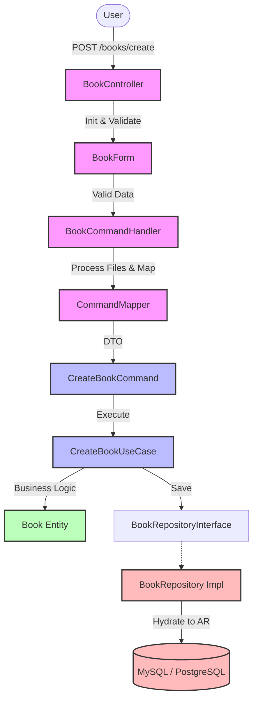

# Сравнение подходов (Yii2 MVC и Clean Architecture)

[← Назад в README](../README.md) • [→ Архитектурные решения](ARCHITECTURE.md)

Документ сравнивает три стилистики организации кода: классический Yii2 MVC, MVC с сервисным слоем и Clean Architecture, реализованную в этом проекте.

## 📌 Навигация

- [📊 Три уровня организации кода](#-три-уровня-организации-кода)
- [🌊 Возможный жизненный цикл запроса (Top-Down Flow)](#возможный-жизненный-цикл-запроса-top-down-flow)
- [🔄 Пример: создание книги](#-пример-создание-книги)
- [📈 Сравнительная таблица](#-сравнительная-таблица)
- [🧩 Разбор паттернов (было → стало)](#-разбор-паттернов-было--стало)
  - [1. Form (отдельная валидация)](#1-form-отдельная-валидация)
  - [2. Command (чёткие данные)](#2-command-чёткие-данные)
  - [3. Mapper (преобразование)](#3-mapper-преобразование)
  - [4. Use Case (бизнес-логика)](#4-use-case-бизнес-логика)
  - [5. Repository (абстракция БД)](#5-repository-абстракция-бд)
  - [6. Value Object (доменные правила)](#6-value-object-доменные-правила)
  - [7. Domain Event (развязка)](#7-domain-event-развязка)
  - [8. Event Mapping (очереди)](#8-event-mapping-очереди)
  - [9. Queue (асинхронность)](#9-queue-асинхронность)
  - [10. Entity (Rich Domain Model)](#10-entity-rich-domain-model)
  - [11. Dependency Isolation (DI vs locator)](#11-dependency-isolation-di-vs-locator)
  - [12. Optimistic Locking (надежность)](#12-optimistic-locking-надежность)
  - [13. Command Pipeline (cross-cutting concerns)](#13-command-pipeline-cross-cutting-concerns)
  - [14. Handlers (слой представления)](#14-handlers-слой-представления)
  - [15. Validation Strategy (pragmatic approach)](#15-validation-strategy-pragmatic-approach)
  - [16. Specification (поиск и фильтрация)](#16-specification-поиск-и-фильтрация)
  - [17. Observability (tracing)](#17-observability-tracing)
  - [18. Разделение интерфейсов (ISP)](#18-разделение-интерфейсов-isp)
  - [19. Бесконечный скролл (HTMX)](#19-бесконечный-скролл-htmx)

---

## 📊 Три уровня организации кода

| Уровень | Подход              | Типичный проект                   |
| ------- | ------------------- | --------------------------------- |
| **1**   | Толстый контроллер  | Новичок, быстрый прототип         |
| **2**   | Контроллер + сервис | Большинство Yii2/Laravel проектов |
| **3**   | Clean Architecture  | Enterprise, сложная бизнес-логика |

[↑ К навигации](#-навигация)

---

## Возможный жизненный цикл запроса (Top-Down Flow)

В классическом MVC (уровни 1 и 2) весь поток управления сосредоточен в контроллере или сервисе. В Clean Architecture путь запроса на изменение данных (Command) проложен через строгие изолированные слои:

1. **User (Браузер)** отправляет HTTP POST запрос с данными.
2. **Controller (Presentation)** принимает запрос, инициализирует объект `Form` и запускает базовую валидацию (правила Yii, например, проверка типов и обязательности полей).
3. **CommandHandler (Presentation)** получает валидную форму. Это связующее звено между вебом и бизнес-логикой. Его задача - обработать веб-зависимые классы (вроде `UploadedFile`) и подготовить данные для ядра.
4. **CommandMapper (Presentation)** помогает хендлеру переложить данные из формы (`Form`) в жестко типизированный, независимый от веба объект команды (`Command DTO`).
5. **UseCase (Application)** - основное место выполнения бизнес-логики. Получает готовую `Command`, достает сущности из репозиториев, просит их выполнить действия и сохраняет результат. Не зависит от HTTP-запросов, сессий и Yii.
6. **Entity & Value Objects (Domain)** - ядро домена. Сущности проверяют инварианты (например, "нельзя опубликовать книгу без автора"), а `Value Objects` (например, `Isbn`) гарантируют валидность собственных свойств. Слой полностью изолирован от базы данных.
7. **Repository (Infrastructure)** - когда `UseCase` инициирует сохранение сущности, инфраструктурная реализация репозитория берет доменную модель, через `Hydrator` перекладывает ее данные в `ActiveRecord`, выполняет запросы к БД и публикует доменные события сущности после коммита транзакции.

**Визуализация потока (на примере создания):**



Благодаря такой цепочке мы можем протестировать шаг **5 и 6 (бизнес-логику)** за миллисекунды без поднятия базы данных, веб-сервера или фреймворка. Достаточно передать в `UseCase` нужную `Command` и использовать in-memory репозиторий.

[↑ К навигации](#-навигация)

---

## 🔄 Пример: создание книги

### Уровень 1: толстый контроллер

```php
// controllers/BookController.php
public function actionCreate()
{
    $model = new Book();

    if ($model->load(Yii::$app->request->post())) {
        // Загрузка файла
        $file = UploadedFile::getInstance($model, 'coverFile');
        if ($file) {
            $path = 'uploads/' . uniqid() . '.' . $file->extension;
            $file->saveAs(Yii::getAlias('@webroot/' . $path));
            $model->cover_url = '/' . $path;
        }

        // Валидация ISBN
        $isbn = str_replace(['-', ' '], '', $model->isbn);
        if (strlen($isbn) !== 13 || !ctype_digit($isbn)) {
            $model->addError('isbn', 'Неверный ISBN');
        }

        if (!$model->hasErrors() && $model->save()) {
            // Синхронизация авторов
            Yii::$app->db->createCommand()
                ->delete('book_authors', ['book_id' => $model->id])
                ->execute();
            foreach ($model->authorIds as $authorId) {
                Yii::$app->db->createCommand()->insert('book_authors', [
                    'book_id' => $model->id,
                    'author_id' => $authorId,
                ])->execute();
            }

            // Уведомления подписчикам
            $phones = Subscription::find()
                ->select('phone')
                ->where(['author_id' => $model->authorIds])
                ->column();
            foreach ($phones as $phone) {
                $sms = new SmsClient(Yii::$app->params['smsApiKey']);
                $sms->send($phone, "Новая книга: {$model->title}");
            }

            Yii::$app->session->setFlash('success', 'Книга создана');
            return $this->redirect(['view', 'id' => $model->id]);
        }
    }

    return $this->render('create', [
        'model' => $model,
        'authors' => ArrayHelper::map(Author::find()->all(), 'id', 'fio'),
    ]);
}
```

#### ✅ Плюсы:

- Быстро написать (30 минут)
- Всё в одном месте - легко найти
- Не нужно думать об архитектуре

#### ❌ Минусы:

- **60+ строк** в одном методе
- `actionUpdate` - копипаста с 80% совпадением
- SMS блокирует ответ страницы (100 подписчиков = 30 сек)
- Тесты: нужен Yii + база + файловая система + SMS API
- Поменял валидацию ISBN - трогаешь контроллер
- Поменял отправку SMS - трогаешь контроллер

---

### Уровень 2: контроллер + сервис

```php
// controllers/BookController.php
public function actionCreate()
{
    $model = new Book();

    if ($model->load(Yii::$app->request->post()) && $model->validate()) {
        $service = new BookService();
        $bookId = $service->create($model);

        if ($bookId) {
            Yii::$app->session->setFlash('success', 'Книга создана');
            return $this->redirect(['view', 'id' => $bookId]);
        }
    }

    return $this->render('create', [
        'model' => $model,
        'authors' => ArrayHelper::map(Author::find()->all(), 'id', 'fio'),
    ]);
}
```

```php
// services/BookService.php
class BookService
{
    public function create(Book $model): ?int
    {
        $transaction = Yii::$app->db->beginTransaction();

        try {
            $file = UploadedFile::getInstance($model, 'coverFile');
            if ($file) {
                $path = 'uploads/' . uniqid() . '.' . $file->extension;
                $file->saveAs(Yii::getAlias('@webroot/' . $path));
                $model->cover_url = '/' . $path;
            }

            if (!$model->save()) {
                throw new \Exception('Ошибка сохранения');
            }

            $this->syncAuthors($model->id, $model->authorIds);
            $transaction->commit();

            $this->notifySubscribers($model);

            return $model->id;
        } catch (\Exception $e) {
            $transaction->rollBack();
            Yii::error($e->getMessage());
            return null;
        }
    }

    private function syncAuthors(int $bookId, array $authorIds): void
    {
        // ... синхронизация
    }

    private function notifySubscribers(Book $model): void
    {
        // ... SMS
    }
}
```

#### ✅ Плюсы:

- Контроллер тонкий
- Логика переиспользуется
- Легче читать

#### ❌ Минусы:

- Сервис всё ещё зависит от `Book` (ActiveRecord)
- Сервис знает про `UploadedFile`, `Yii::$app`
- Тестирование всё ещё требует инфраструктуру
- SMS всё ещё блокирует запрос
- Сервис превращается в «толстый контроллер»

---

### Уровень 3: Clean Architecture (этот проект)

```php
// presentation/controllers/BookController.php
public function actionCreate(): string|Response
{
    $form = $this->itemViewFactory->createForm();

    if (!$this->request->isPost || !$form->loadFromRequest($this->request)) {
        return $this->renderCreateForm($form);
    }

    if ($this->request->isAjax) {
        return $this->asJson(ActiveForm::validate($form));
    }

    if (!$form->validate()) {
        return $this->renderCreateForm($form);
    }

    try {
        $bookId = $this->commandHandler->createBook($form);
        return $this->redirect(['view', 'id' => $bookId]);
    } catch (ApplicationException $e) {
        $this->addFormError($form, $e);
        return $this->renderCreateForm($form);
    }
}
```

```php
// presentation/books/handlers/BookCommandHandler.php
public function createBook(BookForm $form): int
{
    $cover = $this->operationRunner->runStep(
        fn(): ?string => $this->processCoverUpload($form),
        'Failed to upload book cover',
    );

    if ($form->cover instanceof UploadedFile && $cover === null) {
        throw new OperationFailedException(DomainErrorCode::FileStorageOperationFailed->value, field: 'cover');
    }

    $command = $this->commandMapper->toCreateCommand($form, $cover);

    $result = $this->operationRunner->executeAndPropagate(
        $command,
        $this->createBookUseCase,
        Yii::t('app', 'book.success.created'),
    );
    assert(is_int($result));

    return $result;
}
```

```php
// application/books/usecases/ChangeBookStatusUseCase.php
/**
 * @implements UseCaseInterface<ChangeBookStatusCommand, bool>
 */
final readonly class ChangeBookStatusUseCase implements UseCaseInterface
{
    public function __construct(
        private BookRepositoryInterface $bookRepository,
        private BookPublicationPolicy $publicationPolicy,
    ) {
    }

    /**
     * @param ChangeBookStatusCommand $command
     */
    public function execute(object $command): bool
    {
        $book = $this->bookRepository->get($command->bookId);
        $policy = $command->targetStatus === BookStatus::Published ? $this->publicationPolicy : null;
        $book->transitionTo($command->targetStatus, $policy);

        $this->bookRepository->save($book);

        return true;
    }
}
```

```php
// domain/values/Isbn.php
final readonly class Isbn implements \Stringable
{
    private const array ISBN13_PREFIXES = ['978', '979'];

    public private(set) string $value;

    public function __construct(string $value)
    {
        $normalized = self::normalizeIsbn($value);

        if (!self::isValid($normalized)) {
            throw new ValidationException(DomainErrorCode::IsbnInvalidFormat);
        }

        $this->value = $normalized;
    }
}
```

#### ✅ Плюсы:

- Use Case не знает про Yii
- Тестируется изолированно
- SMS уходят в очередь
- Value Object гарантирует валидность
- Каждый класс имеет одну ответственность

#### ❌ Минусы:

- Больше файлов на операцию
- Выше порог входа
- Избыточно для простых CRUD

[↑ К навигации](#-навигация)

---

## 📈 Сравнительная таблица

| Критерий                    | Толстый контроллер | +Сервис                     | Clean Architecture               |
| --------------------------- | ------------------ | --------------------------- | -------------------------------- |
| **Время разработки**        | ⚡ 30 мин          | ⚡ 1 час                    | 🐢 3-4 часа                      |
| **Файлов на операцию**      | 1                  | 2                           | 6-8                              |
| **Строк кода**              | 60 в одном         | 15 + 80                     | 15 + 20 + 25 + ...               |
| **Unit-тесты**              | ❌ Невозможно      | ⚠️ Сложно                   | ✅ Легко                         |
| **Покрытие тестами**        | 0-10%              | 10-30%                      | 100%                             |
| **SMS блокирует**           | ✅ Да              | ✅ Да                       | ❌ Нет (очередь)                 |
| **Зависимость от Yii**      | 🔴 Везде           | 🟡 В сервисе                | 🟢 Infrastructure + Presentation |
| **Изменить провайдера SMS** | Правим контроллер  | Правим сервис               | Новый адаптер                    |
| **Копипаста Create/Update** | 80%                | 50%                         | 10%                              |
| **Правила домена**          | В контроллере      | В сервисе                   | Entity/Policy                    |
| **Поиск/фильтрация**        | AR в контроллере   | AR в сервисе                | Specifications + Query Service   |
| **Маппинг данных**          | Ручной             | Ручной                      | AutoMapper (атрибуты)            |
| **Гидрация сущностей**      | Свойства AR        | ActiveRecord::setAttributes | ActiveRecordHydrator             |
| **Хранилище файлов**        | `uploads/`         | `uploads/`                  | CAS (контентно-адресуемое)       |
| **Поддержка через 2 года**  | 😱 Ад              | 😐 Норм                     | 😊 Легко                         |

[↑ К навигации](#-навигация)

---

## 🧩 Разбор паттернов (было → стало)

### 1. Form (отдельная валидация)

**Было (в модели Book):**

```php
class Book extends ActiveRecord
{
    public $coverFile;
    public $authorIds;

    public function rules()
    {
        return [
            ['title', 'string', 'max' => 255],
            ['coverFile', 'file', 'extensions' => 'png, jpg'],
            // + сценарии create/update
        ];
    }
}
```

❌ **Проблема:** модель смешивает хранение и валидацию ввода.

**Стало (BookForm):**

```php
// presentation/books/forms/BookForm.php
final class BookForm extends Model
{
    /** @var int|string|null */
    public $id;

    /** @var string */
    public $title = '';

    /** @var int|string|null */
    public $year;

    /** @var string|null */
    public $description;

    /** @var string|int|null */
    public $isbn = '';

    /** @var array<int>|string|null */
    public $authorIds = [];

    /** @var UploadedFile|string|null */
    public $cover;
    public int $version = 1;
}
```

✅ **Результат:** форма отвечает только за ввод, AR - только за persistence.

---

### 2. Command (чёткие данные)

**Было:**

```php
$service->create($model);  // Book? BookForm? Array?
```

❌ **Проблема:** непонятный контракт.

**Стало:**

```php
$command = new CreateBookCommand(
    title: 'Название',
    year: 2024,
    description: 'Короткое описание',
    isbn: '9783161484100',
    authorIds: AuthorIdCollection::fromArray([1, 2]),
    storedCover: '/covers/123.png',
);
$useCase->execute($command);
```

✅ **Результат:** строгие типы и явные поля.

---

### 3. Mapper (преобразование)

**Было (в контроллере):**

```php
$command = new CreateBookCommand(
    $form->title,
    $form->year,
    $form->isbn,
    $form->authorIds,
    $coverUrl
);
```

❌ **Проблема:** копипаста маппинга.

**Стало:**

```php
$command = $this->commandMapper->toCreateCommand($form, $cover);
```

✅ **Результат:** типизированный маппинг через выделенный `CommandMapper` и меньше рутины.

---

### 4. Use Case (бизнес-логика)

**Было:**

```php
public function actionCreate()
{
    // Внутри контроллера: бизнес-правила, SQL, файлы, SMS
}
```

❌ **Проблема:** бизнес-логика смешана с инфраструктурой.

**Стало:**

```php
// application/books/usecases/CreateBookUseCase.php
public function execute(object $command): int
{
    $authorIds = $command->authorIds->toArray();
    $isbn = new Isbn($command->isbn);

    if ($this->bookIsbnChecker->existsByIsbn($command->isbn)) {
        throw new AlreadyExistsException(DomainErrorCode::BookIsbnExists);
    }

    if ($authorIds !== [] && !$this->authorExistenceChecker->existsAllByIds($authorIds)) {
        throw new EntityNotFoundException(DomainErrorCode::BookAuthorsNotFound);
    }

    $currentYear = (int) $this->clock->now()->format('Y');
    $coverImage = $command->storedCover !== null ? new StoredFileReference($command->storedCover) : null;

    $book = Book::create(
        title: $command->title,
        year: new BookYear($command->year, $currentYear),
        isbn: $isbn,
        description: $command->description,
        coverImage: $coverImage,
    );
    $book->replaceAuthors($authorIds);

    return $this->bookRepository->save($book);
}
```

✅ **Результат:** бизнес-логика сосредоточена в Use Case.

---

### 5. Repository (абстракция БД)

**Было:**

```php
Book::find()->where(['id' => $id])->one();
```

❌ **Проблема:** зависимость домена от AR.

**Стало:**

```php
// domain/repositories/BookRepositoryInterface.php
interface BookRepositoryInterface
{
    public function save(Book $book): int;
    public function get(int $id): Book;
    public function getByIdAndVersion(int $id, int $expectedVersion): Book;
    public function delete(Book $book): void;
}
```

```php
// infrastructure/repositories/BookRepository.php
public function save(BookEntity $book): int
{
    /** @var int */
    return $this->db->transaction(function () use ($book): int {
        $isNew = $book->getId() === null;
        $model = $isNew ? new Book() : $this->getArForEntity($book, Book::class, DomainErrorCode::BookNotFound);
        $model->version = $book->version;

        $this->hydrator->hydrate($model, $book, [
            'title',
            'year',
            'isbn',
            'description',
            'cover_url' => static fn(BookEntity $e): ?string => $e->coverImage?->getPath(),
            'status' => static fn(BookEntity $e): string => $e->status->value,
        ]);

        $this->persist($model, DomainErrorCode::BookStaleData, DomainErrorCode::BookIsbnExists);

        // ... identity assignment, author sync

        $this->publishRecordedEvents($book);

        return (int)$model->id;
    });
}
```

✅ **Результат:** домен не знает о БД, инфраструктура скрыта.

---

### 6. Value Object (доменные правила)

**Было:**

```php
if (strlen($isbn) !== 13 || !ctype_digit($isbn)) {
    $model->addError('isbn', 'Неверный ISBN');
}
```

**Стало:**

```php
final readonly class Isbn implements \Stringable
{
    private const array ISBN13_PREFIXES = ['978', '979'];

    public private(set) string $value;

    public function __construct(string $value)
    {
        $normalized = self::normalizeIsbn($value);

        if (!self::isValid($normalized)) {
            throw new ValidationException(DomainErrorCode::IsbnInvalidFormat);
        }

        $this->value = $normalized;
    }
}
```

✅ **Результат:** невозможно создать невалидный ISBN.

---

### 7. Domain Event (развязка)

**Было:**

```php
Yii::$app->queue->push(new NotifyJob($bookId));
```

❌ **Проблема:** бизнес-логика знает про очередь.

**Стало:**

```php
// domain/events/BookStatusChangedEvent.php
final readonly class BookStatusChangedEvent implements QueueableEvent
{
    public const string EVENT_TYPE = 'book.status_changed';

    public function __construct(
        public int $bookId,
        public BookStatus $oldStatus,
        public BookStatus $newStatus,
        public int $year,
    ) {
    }
}
```

```php
// domain/entities/Book.php (RecordsEvents trait)
public function transitionTo(BookStatus $target, ?BookPublicationPolicy $policy = null): void
{
    // ... валидация переходов ...
    $oldStatus = $this->status;
    $this->status = $target;

    if ($this->id !== null) {
        $this->recordEvent(new BookStatusChangedEvent($this->id, $oldStatus, $target, $this->year->value));
    }
}
```

```php
// infrastructure/repositories/BookRepository.php
private function publishRecordedEvents(BookEntity $book): void
{
    foreach ($book->pullRecordedEvents() as $event) {
        $this->eventPublisher->publishAfterCommit($event);
    }
}
```

✅ **Результат:** сущность записывает события через `recordEvent()`, репозиторий публикует их после коммита. Use Case не знает о событиях.

---

### 8. Event Mapping (очереди)

**Было:**

```php
if ($event instanceof BookPublishedEvent) {
    Yii::$app->queue->push(new NotifySubscribersJob(...));
}
```

❌ **Проблема:** условная логика разрастается.

**Стало:**

```php
// config/container/adapters.php
EventJobMappingRegistry::class => static fn(Container $c): EventJobMappingRegistry => new EventJobMappingRegistry(
    [
        BookStatusChangedEvent::class => static fn(BookStatusChangedEvent $e): ?NotifySubscribersJob => $e->newStatus === BookStatus::Published
            ? new NotifySubscribersJob($e->bookId)
            : null,
    ],
    $c->get(EventSerializer::class),
),
```

✅ **Результат:** маппинг событий централизован в конфигурации с условной логикой.

---

### 9. Queue (асинхронность)

**Было:**

```php
foreach ($subscribers as $sub) {
    $sms->send($sub->phone, ...);
}
```

❌ **Проблема:** страница ждёт отправку.

**Стало:**

```php
// infrastructure/queue/handlers/NotifySubscribersHandler.php
public function handle(int $bookId, Queue $queue): void
{
    $book = $this->bookQueryService->findById($bookId);

    if (!$book instanceof BookReadDto) {
        $this->logger->warning('Book not found for notification', ['book_id' => $bookId]);
        return;
    }

    $title = $book->title;
    $message = $this->translator->translate('app', 'notification.book.released', ['title' => $title]);
    $totalDispatched = 0;

    foreach ($this->queryService->getSubscriberPhonesForBook($bookId) as $phone) {
        $queue->push(new NotifySingleSubscriberJob(
            $phone,
            $message,
            $bookId,
        ));
        $totalDispatched++;
    }

    $this->logger->info('SMS notification jobs dispatched', [
        'book_id' => $bookId,
        'book_title' => $title,
        'total_jobs' => $totalDispatched,
    ]);
}
```

✅ **Результат:** fan-out в фоне, UI отвечает мгновенно.

---

### 10. Entity (Rich Domain Model)

**Было:**

```php
class Book extends ActiveRecord
{
    public function publish(): void
    {
        $this->status = 'published';
        $this->save();
    }
}
```

**Стало:**

```php
// domain/entities/Book.php
final class Book implements RecordableEntityInterface
{
    use RecordsEvents;

    private function __construct(
        public private(set) ?int $id,
        string $title,
        public private(set) BookYear $year,
        public private(set) Isbn $isbn,
        public private(set) ?string $description,
        public private(set) ?StoredFileReference $coverImage,
        array $authorIds,
        public private(set) BookStatus $status,
        public private(set) int $version,
    ) {
        $this->title = $title;
        $this->authorIds = array_map(intval(...), $authorIds);
    }

    public static function create(/* ... */): self
    {
        return new self(id: null, /* ... */, status: BookStatus::Draft, version: 1);
    }

    public static function reconstitute(/* все поля */): self
    {
        return new self(/* ... */);
    }

    public function transitionTo(BookStatus $target, ?BookPublicationPolicy $policy = null): void
    {
        if (!$this->status->canTransitionTo($target)) {
            throw new BusinessRuleException(DomainErrorCode::BookInvalidStatusTransition);
        }

        if ($target === BookStatus::Published) {
            if (!$policy instanceof BookPublicationPolicy) {
                throw new BusinessRuleException(DomainErrorCode::BookPublishWithoutPolicy);
            }

            $policy->ensureCanPublish($this);
        }

        $oldStatus = $this->status;
        $this->status = $target;

        if ($this->id === null) {
            return;
        }

        $this->recordEvent(new BookStatusChangedEvent($this->id, $oldStatus, $target, $this->year->value));
    }

    public function markAsDeleted(): void
    {
        if ($this->id === null) {
            return;
        }

        $this->recordEvent(new BookDeletedEvent(
            $this->id,
            $this->year->value,
            $this->status === BookStatus::Published,
        ));
    }

    /**
     * @param int[] $authorIds
     */
    public function replaceAuthors(array $authorIds): void
    {
        if ($authorIds === [] && $this->status !== BookStatus::Draft) {
            throw new BusinessRuleException(DomainErrorCode::BookPublishWithoutAuthors);
        }

        $this->authorIds = [];

        foreach ($authorIds as $authorId) {
            $this->addAuthor($authorId);
        }
    }

    public function addAuthor(int $authorId): void
    {
        if ($authorId <= 0) {
            throw new ValidationException(DomainErrorCode::BookInvalidAuthorId);
        }

        if (in_array($authorId, $this->authorIds, true)) {
            return;
        }

        $this->authorIds[] = $authorId;
    }
}
```

✅ **Результат:** сущность чистая и тестируемая.

---

### 11. Dependency Isolation (DI vs locator)

**Было:**

```php
Yii::$app->db->createCommand(...);
Yii::$app->queue->push(...);
```

**Стало:**

```php
final readonly class ChangeBookStatusUseCase implements UseCaseInterface
{
    public function __construct(
        private BookRepositoryInterface $bookRepository,
        private BookPublicationPolicy $publicationPolicy,
    ) {
    }
}
```

✅ **Результат:** зависимости передаются через конструкторы, а Use Case не знает про Yii.

---

### 12. Optimistic Locking (надежность)

**Было:**

```php
// Потеря обновлений при параллельной записи
```

**Стало:**

```php
// infrastructure/persistence/Book.php
public function behaviors(): array
{
    return [
        TimestampBehavior::class,
        [
            'class' => OptimisticLockBehavior::class,
            'value' => fn(): int => $this->version ?? 1,
        ],
    ];
}

public function optimisticLock(): string
{
    return 'version';
}
```

```php
// infrastructure/repositories/BookRepository.php
$model->version = $book->version;
$this->persist($model, DomainErrorCode::BookStaleData, DomainErrorCode::BookIsbnExists);
```

✅ **Результат:** конфликт версий ловится и превращается в доменное исключение.

---

### 13. Command Pipeline (cross-cutting concerns)

**Было:**

```php
public function create(Book $model)
{
    $transaction = Yii::$app->db->beginTransaction();
    try {
        $this->tracer->start('create_book');
        // бизнес-логика...
        $transaction->commit();
    } catch (\Throwable $e) {
        $transaction->rollBack();
        throw $e;
    }
}
```

**Стало:**

```php
// application/common/pipeline/PipelineFactory.php
public function createDefault(): PipelineInterface
{
    return new Pipeline()
        ->pipe($this->exceptionTranslationMiddleware)
        ->pipe(new TransactionMiddleware($this->transaction));
}
```

```php
// presentation/common/services/WebOperationRunner.php
$result = $this->pipelineFactory->createDefault()->execute($command, $useCase);
```

✅ **Результат:** сквозные аспекты вынесены в middleware.

---

### 14. Handlers (слой представления)

**Было:**

```php
// Контроллер делает всё
```

**Стало:**

```php
// presentation/books/handlers/BookCommandHandler.php
public function createBook(BookForm $form): int
{
    $cover = $this->operationRunner->runStep(
        fn(): ?string => $this->processCoverUpload($form),
        'Failed to upload book cover',
    );

    if ($form->cover instanceof UploadedFile && $cover === null) {
        throw new OperationFailedException(DomainErrorCode::FileStorageOperationFailed->value, field: 'cover');
    }

    $command = $this->commandMapper->toCreateCommand($form, $cover);

    $result = $this->operationRunner->executeAndPropagate(
        $command,
        $this->createBookUseCase,
        Yii::t('app', 'book.success.created'),
    );
    assert(is_int($result));

    return $result;
}
```

✅ **Результат:** контроллер остаётся координатором, а Handler концентрирует логику команды.

---

### 15. Validation Strategy (pragmatic approach)

**Было (ActiveRecord rules):**

```php
[['isbn'], 'unique'],
```

**Стало:**

```php
// presentation/books/forms/BookForm.php - правила формы
#[Override]
public function rules(): array
{
    return [
        [['title', 'year', 'isbn', 'authorIds'], 'required'],
        [['year'], 'integer', 'min' => 1000, 'max' => (int)date('Y') + 5],
        [['description'], 'string'],
        [['title'], 'string', 'max' => 255],
        [['isbn'], 'string', 'max' => 20],
        [['isbn'], IsbnValidator::class],
        [['authorIds'], 'each', 'rule' => ['integer']],
        // ...
    ];
}
```

```php
// infrastructure/repositories/BaseActiveRecordRepository.php
protected function persist(
    ActiveRecord $model,
    ?DomainErrorCode $staleError,
    ?DomainErrorCode $duplicateError = null,
): void {
    try {
        if (!$model->save(false)) {
            $errors = $model->getFirstErrors();
            $message = $errors !== [] ? json_encode($errors, JSON_UNESCAPED_UNICODE) : 'Unknown error';
            throw new OperationFailedException(DomainErrorCode::EntityPersistFailed, 0, new RuntimeException((string)$message));
        }
    } catch (StaleObjectException) {
        if (!$staleError instanceof DomainErrorCode) {
            throw new OperationFailedException(DomainErrorCode::EntityPersistFailed);
        }

        throw new StaleDataException($staleError);
    } catch (IntegrityException $e) {
        if ($this->isDuplicateError($e)) {
            if ($duplicateError instanceof DomainErrorCode) {
                throw new AlreadyExistsException($duplicateError, 409, $e);
            }

            throw new AlreadyExistsException(DomainErrorCode::EntityAlreadyExists, 409, $e);
        }

        throw $e;
    }
}
```

✅ **Результат:** форма даёт быстрый фидбек, а БД гарантирует целостность.

---

### 16. Specification (поиск и фильтрация)

**Было:**

```php
return Book::find()
    ->where(['year' => $year])
    ->andWhere(['like', 'title', $term])
    ->all();
```

**Стало:**

```php
// application/books/factories/BookSearchSpecificationFactory.php
$specification = $factory->createFromSearchTerm($term);

// infrastructure/queries/BookQueryService.php
$visitor = new ActiveQueryBookSpecificationVisitor($query, $this->db);
$specification->accept($visitor);
```

✅ **Результат:** критерии в домене, SQL остаётся в инфраструктуре.

---

### 17. Observability (tracing)

**Было:**

```php
// Логи разбросаны по проекту
```

**Стало:**

```php
// infrastructure/queries/decorators/ReportQueryServiceCachingDecorator.php
final class ReportQueryServiceCachingDecorator implements ReportQueryServiceInterface
{
    public function __construct(
        private ReportQueryServiceInterface $inner,
        private CacheInterface $cache,
        private int $cacheTtl,
    ) {
    }

    public function getTopAuthors(ReportCriteria $criteria): array
    {
        $key = 'report_top_authors_' . $criteria->year;
        $cached = $this->cache->get($key);
        if ($cached !== null) {
            return $cached;
        }

        $result = $this->inner->getTopAuthors($criteria);
        $this->cache->set($key, $result, $this->cacheTtl);

        return $result;
    }
}
```

✅ **Результат:** трассировка добавляется без изменения бизнес-кода.

---

### 18. Разделение интерфейсов (ISP)

**Было:**

```php
interface BookRepositoryInterface {
    public function save(Book $book): void;
    public function get(int $id): Book;
    public function search(string $term): array;
}
```

**Стало:**

```php
interface BookRepositoryInterface
{
    public function save(Book $book): int;
    public function get(int $id): Book;
    public function getByIdAndVersion(int $id, int $expectedVersion): Book;
    public function delete(Book $book): void;
}

interface BookFinderInterface
{
    public function findById(int $id): ?BookReadDto;
    public function findByIdWithAuthors(int $id): ?BookReadDto;
}

interface BookSearcherInterface
{
    public function search(string $term, int $page, int $limit): PagedResultInterface;
    public function searchPublished(string $term, int $page, int $limit): PagedResultInterface;
    public function searchBySpecification(
        BookSpecificationInterface $specification,
        int $page,
        int $limit,
    ): PagedResultInterface;
}
```

✅ **Результат:** зависимости Use Cases ограничены нужными методами.

---

### 19. Бесконечный скролл (HTMX)

**Было:**

- Перезагрузка страницы на `?page=2`
- Или jQuery-логика с ручным DOM-апдейтом

**Стало:**

```html
<div
  hx-get="/site/index?page=2"
  hx-target="#book-cards-container"
  hx-swap="beforeend"
  hx-trigger="revealed"
  hx-select="#book-cards-container > .col-md-4, #load-more-container"
  hx-select-oob="#load-more-container"
></div>
```

✅ **Результат:** бесшовная подгрузка без тяжёлого JS.

[↑ К навигации](#-навигация)
